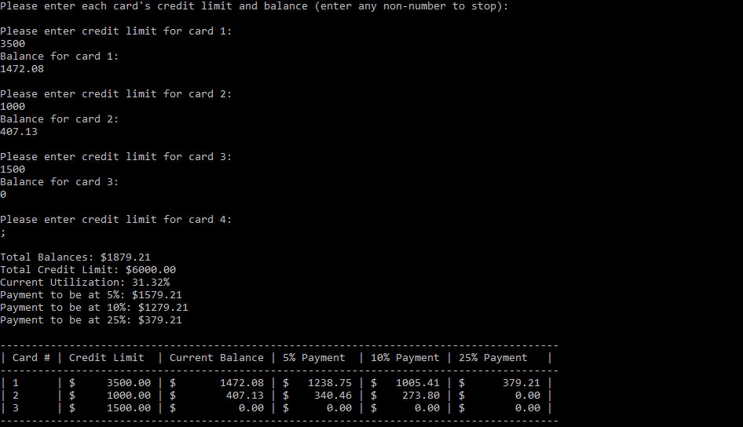

# Credit Utilization Tool

## A C++ program that aims to help users calculate suggested credit card payments to optimize total utilization, maximizing their potential to improve their credit score.

This tool helps users decide how much to pay towards their credit cards before their statement balance. Targets ranging from 5% to 25% credit utilization give users flexibility in their balance between financing purchases and improving their credit score. The program also prioritizes cards with a higher existing utilization, and suggests the payment amount to keep them below 30% utilization, minimizing risk. 

In this sample output, the user inputs three cards along with their respective credit limits and current balances. The program provides a summary of the user's current total balances, credit limit, current utilization, and the total payments required to reach target utilization levels of 5%, 10%, and 25%. In the table below, each card is listed, along with its limit and balance. The program prioritizes paying down cards with higher utilization first to ensure no single card exceeds 30% utilization. Going with a lower utilization target such as 5% will improve the user's credit score much faster than with a higher target. 

## Features
* Input limitless credit cards
* Automatically calculate total credit utilization percentage
* Determine payment amounts to reach targets of:
	* 5% total utilization
	* 10% total utilization
	* 25% total utilization
* Suggest payments spread across cards while ensuring no individual card exceeds 30% utilization
* Display results in an easy to read, clean table format

## How to install and run
Users can either download and launch the .exe file or compile and run in any modern C++ compiler.

## Future Improvements
Potential improvements to this tool may include:
* File saving/exporting to .csv or .txt
* Custom utilization targets
* GUI implementation